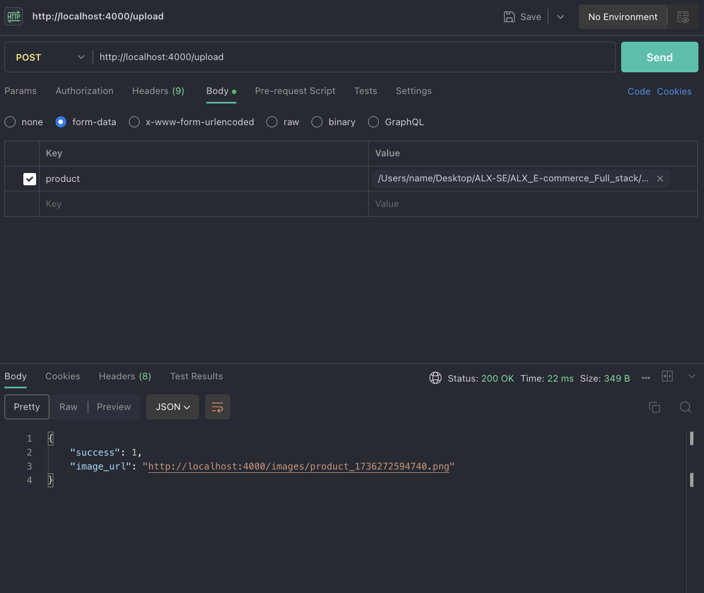

## ALX_E-commerce_Full_stack


## Backend Features for E-Shopper API

This backend application is designed for an e-commerce platform, **E-Shopper**, built with Node.js, Express, and MongoDB. Below is an overview of the key features and functionality:

### 1. **Express API**
- The backend uses the **Express** framework to create a RESTful API.
- A root endpoint (`GET /`) confirms that the API is running by returning a success message.

### 2. **Database Connection**
- **MongoDB** is used as the database, and it is connected using **Mongoose**, an Object Data Modeling (ODM) library for Node.js.
- A secure connection is established with MongoDB Atlas to handle data storage.

### 3. **File Upload with Multer**
- The API supports image uploads using the **Multer** middleware.
- Uploaded files are stored in the `./upload/images` directory.
- File naming is automated using a timestamp to ensure uniqueness (e.g., `product_1678901234567.jpg`).
- Static file hosting allows accessing uploaded images via URLs, such as `http://localhost:4000/images/{filename}`.

### 4. **Product Schema and Database Operations**
- A **Mongoose Schema** defines the structure of the `Product` collection in MongoDB:
  - **Fields**: `id`, `name`, `image`, `category`, `new_price`, `old_price`, `date`, and `available`.
  - Validation and defaults ensure data integrity (e.g., unique IDs, required fields, and default values).
- **Add Product Endpoint**:
  - `POST /addproduct`: Adds new products to the database.
  - Validates incoming data and saves it to the `Product` collection.
  - Returns a success response with the product name or an error message if the operation fails.

### 5. **Image Upload Endpoint**
- `POST /upload`: Accepts image uploads with the field name `product`.
- Responds with:
  ```json
  {
    "success": 1,
    "image_url": "http://localhost:4000/images/product_1736270055429.png"
  }


--------------------------------------------------------------------------------------------------------------------------------------

### I used Postman to Upload Product to my DATABASE

### API Testing with Postman

We use **Postman** to test and debug API endpoints in this project. Postman is a powerful tool that simplifies API development by providing a user-friendly interface for sending HTTP requests and analyzing responses.

#### Why Use Postman?

1. **Efficient Testing**:
   - Postman enables you to test various HTTP methods (GET, POST, PUT, DELETE, etc.) and validate the behavior of your API endpoints.
   - It helps ensure that your API works as expected before integrating it with the frontend or other systems.

2. **File Upload Testing**:
   - For endpoints like `/upload`, which handle file uploads, Postman allows you to attach files via the `Body -> form-data` option.
   - This makes it easy to verify file upload functionality and check if files are stored and accessible correctly.

3. **Detailed Response Analysis**:
   - Postman provides detailed information about the API response, including:
     - **Status Code**: Confirms the success or failure of the request (e.g., `200 OK`, `400 Bad Request`, `500 Internal Server Error`).
     - **Response Body**: Displays the data returned by the server in JSON, HTML, or other formats.
     - **Headers and Metadata**: Useful for debugging CORS issues or authentication problems.

4. **Simplifies Workflow**:
   - By using Postman, developers can quickly test API changes without writing additional code or creating custom clients.
   - Variables and environments in Postman make it easier to switch between development, staging, and production setups.

#### Example Use Case in This Project:

- **Testing File Upload**: 
  - Endpoint: `POST http://localhost:4000/upload`
  - Steps:
    1. Use the `Body -> form-data` option in Postman.
    2. Set the field name to `product` and choose the image file to upload.
    3. Submit the request and verify the response, which includes the uploaded file's URL (e.g., `"http://localhost:4000/images/product_1736270055429.png"`).

- **Testing Product Creation**:
  - Endpoint: `POST http://localhost:4000/addproduct`
  - Steps:
    1. Set the request body to `raw` and choose `JSON` format.
    2. Provide a JSON object with the required fields (e.g., `id`, `name`, `image`, etc.).
    3. Submit the request and confirm the success response.

## API Features

## ALX_E-commerce_Full_stack

### 3. **File Upload with Multer**
Here is a screenshot of the file upload functionality:



*Figure 1: Uploading a product image via the API.*

#### Why It’s Essential:
Postman ensures that your API is functional, reliable, and meets its intended purpose. By testing endpoints thoroughly, you can catch and fix issues early in the development process.


---------------------------------------------------------------
---------------------------------------------------------------
### Setting Up MongoDB with Mongoose

To store and manage objects in the MongoDB database, we use the **Mongoose** library, which provides a structured way to interact with MongoDB. Before uploading any object to the database, it is essential to define a schema. 

#### Why Use a Schema?
A schema acts as a blueprint for the data structure, ensuring consistency and validation for the objects being stored. With Mongoose, we define the schema and create a model based on it, which allows us to perform database operations like saving, querying, updating, and deleting records.

#### Example:
In this project, we defined a schema for a product using Mongoose:
```javascript
const Product = mongoose.model("Product", {
    id: { type: Number, required: true, unique: true },
    name: { type: String, required: true },
    image: { type: String, required: true },
    category: { type: String, required: true },
    new_price: { type: Number, required: true },
    old_price: { type: Number, required: true },
    date: { type: Date, default: Date.now },
    available: { type: Boolean, default: true },
});

------------------------------------------------------------------------------------------------------------------------------------

### Admin Control Panel  

This project is a **Control Panel** for the **ALX E-commerce Full-Stack Application**. The panel is built using **Vite**, which provides a fast and lightweight development environment for modern web applications.  

## Features  
- **Framework**: React was chosen for building dynamic and interactive components.  
- **Variant**: JavaScript is used for simplicity and flexibility in the development process.  
- **Scaffolding Tool**: Vite was used for its superior speed, module-based development, and Hot Module Replacement (HMR) capabilities.  

## Setup  

### Prerequisites  
Ensure the following tools are installed on your system:  
- **Node.js** (version 14 or later)  
- **npm** (comes with Node.js)  

### Installation  

1. Clone the repository to your local machine:  
   ```bash
   git clone <repository-url>

-----------------------------------------------------------------
# Admin Control Panel for ALX E-commerce Full-Stack Application  

This is the **Admin Control Panel** for the **ALX E-commerce Full-Stack Application**, designed to manage and oversee the application's functionality. It is built using **React** and **Vite** for a fast, modern, and efficient development experience.

## Features  
- **Framework**: React for dynamic and interactive UI components.  
- **Variant**: JavaScript for flexibility and ease of integration.  
- **Scaffolding Tool**: Vite for fast development, optimized build processes, and Hot Module Replacement (HMR).  

## Setup  

### Prerequisites  
Before you begin, ensure the following tools are installed:  
- **Node.js** (version 14 or later)  
- **npm** (comes with Node.js)  

### Installation  

1. Clone this repository to your local machine:  
   ```bash
   git clone <repository-url>
